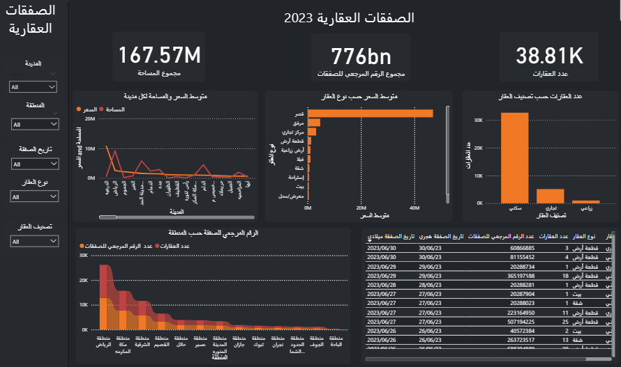

# Real Estate Deals Project – Data Jam Challenge 2023

## Project Description 🏘️
This project analyzes real estate deals using Power BI tools.  
It focuses on calculating the average price for each property type, counting properties by classification, analyzing areas per region, and summarizing total reference numbers for the deals.

## Project Contents 📊
- Average price calculation for different property types  
- Count of properties by categories  
- Area analysis for each region  
- Total reference numbers for deals  

## How to Run 🖥️
1. Make sure Power BI Desktop is installed on your machine.  
2. Download the `RealEstateDeals.pbix` file from this repository.  
3. Open the file using Power BI Desktop to explore the dashboard.  

## Features 🎯
- Clear overview of property types and their average prices  
- Interactive charts for property counts and area analysis  
- Insightful metrics on total reference numbers  

## Technologies Used 🛠️
- Power BI Desktop – dashboard creation and visualization  
- Excel / CSV – source data files  
- Data Modeling – for relationships and calculated metrics  

## Dashboard Screenshot 🖼️
  
*Note: This screenshot shows the layout and key insights of the dashboard.*
